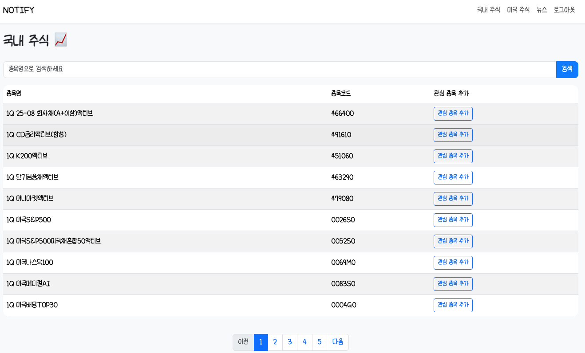
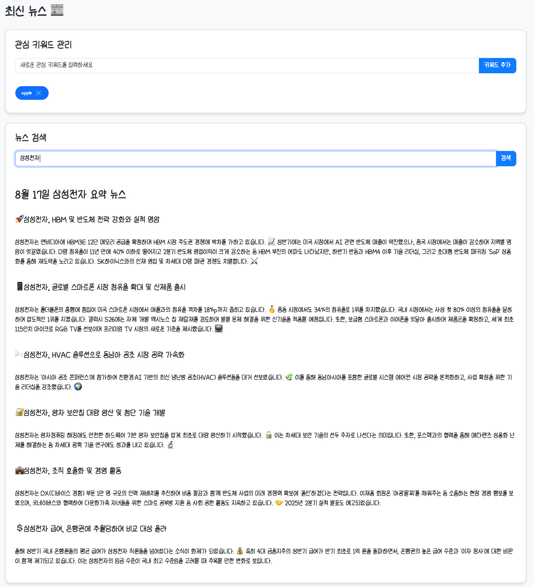
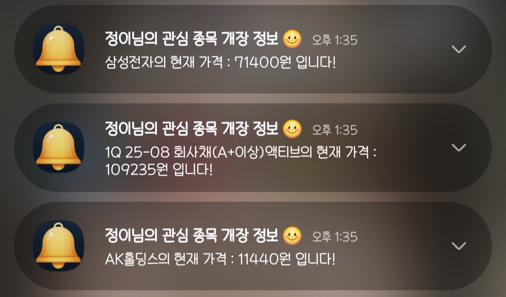

# New Notify

### 주소
- https://new-notify.n-e.kr/

### 서비스 내용
- 맞춤형 뉴스 요약
  - 사용자가 설정한 키워드에 맞춰 `Gemini AI`가 뉴스를 요약하여 제공합니다.
- 주식 알림 서비스
  - 관심 있는 종목의 시가와 종가를 알림으로 제공합니다.
- 크로스 플랫폼 알림
  - `FCM(Firebase Cloud Messaging)`을 이용하여 웹과 안드로이드에서 알림을 받을 수 있습니다.

### 개발 목적
- 기존 Notify 서비스의 문제점을 해결하고 더욱 효율적인 서비스를 제공하기 위해 개발되었습니다. 
  - `마이크로 서비스 아키텍처(MSA) 도입`
    - 모놀리식 구조의 한계를 극복하고 각 기능을 독립적으로 개발, 배포하여 유지보수성과 확장성을 높였습니다. 
  - `뉴스 요약 기능 강화`
    - 기존의 네이버 API 대신 **RSS XML**을 활용하고, **Gemini API**를 통해 더욱 정확하고 자연스러운 뉴스 요약을 제공합니다. 
  - `알림 채널 변경`
    - 서비스가 중단된 LINE 메시지 대신 **FCM**을 도입하여 안정적인 알림 환경을 구축했습니다. 
  - `효율적인 데이터 관리`
    - **스프링 배치**를 활용하여 국내 및 미국 주식 정보를 매일 자정에 갱신합니다.

### 기술 스택
- 백엔드
  - Java 17, Spring Boot 3.5.4, Spring Batch, Kafka 
- 데이터베이스
  - MariaDB 
- 인프라 & 기타
  - Docker, Gemini API, FCM

### 사용 화면

